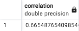
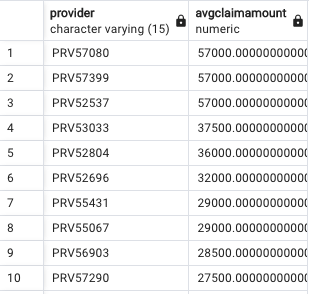
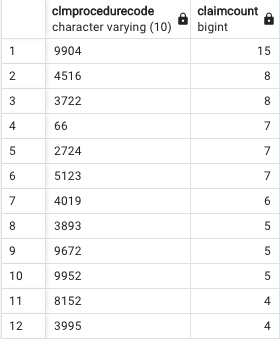
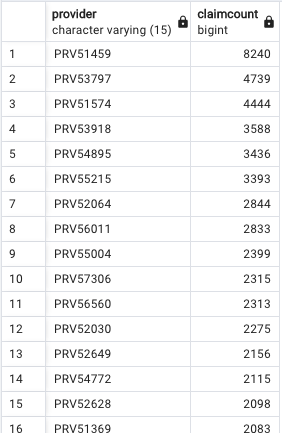

# Healthcare-Provider-Fraud-Dection-Analysis
Analyzing healthcare fraud with PostgreSQL, Pandas, and ML

 

  

 

## Introduction

 

In the field of healthcare, detecting fraud is essential for preserving cost effectiveness and delivering top-notch patient care. To tackle this issue, a machine learning model has been designed to identify fraudulent medical claims using a dataset sourced from Kaggle (https://www.kaggle.com/datasets/rohitrox/healthcare-provider-fraud-detection-analysis). This examination encompasses the stages of data exploration, data cleansing, and model creation, with the objective of developing a machine learning model capable of predicting healthcare fraud.

 

## Analysis

 

The analysis starts with an inspection of the data supplied in CSV format. The data consists of three tables: InpatientClaim, OutpatientClaim, and Beneficiary. These tables hold details about inpatient and outpatient claims as well as their associated beneficiaries. Throughout the data exploration stage, SQL queries were executed to address questions like:

* Which providers have the highest number of claims?
* What types of procedures are most commonly claimed?
* Which providers have the highest average claim amount?
* Are there any correlations between the different features in the dataset?

 

  

 
 

  

 
 

  

 
 

  

 
 

The CSV files were then combined and loaded into a pandas DataFrame for further processing.

## Machine Learning Model

Before building the machine learning model, the data was preprocessed and cleaned. This included:

* Converting date columns to datetime format
* Handling missing values (NaN) by filling them with appropriate values or replacing them with 'Unknown'
* Checking for duplicate records and removing them if necessary

Upon data cleansing, markers were established in the inpatient and outpatient datasets to differentiate the two claim categories. Subsequently, the inpatient and outpatient datasets were combined to form a consolidated 'train_claims' dataset.

The 'train_claims' dataset was then merged with the 'train_beneficiary' dataset, resulting in an all-encompassing 'train_data' dataset. Following this, the duration of stay for each claim and the cumulative count of chronic conditions for every beneficiary were computed. These newly derived features have the potential to enhance the machine learning model's performance

## Preprocessing

 

Before training the model, the data was preprocessed as follows:

1. Renamed the 'PotentialFraud' column to 'Fraud' and mapped its values to binary labels (1 for 'Yes' and 0 for 'No').
2. Removed the 'DOD', 'BeneID', and 'ClaimID' columns as they are not relevant to the model.
3. Calculated the claim duration and created a new 'ClaimDuration' column.
4. Created a new 'NumUniquePhysicians' column, which represents the number of unique physicians involved in a claim.
5. Calculated the patient age at the time of the claim and created a new 'PatientAge' column.
6. Removed the 'AdmissionDt' and 'DischargeDt' columns, as they are no longer needed after calculating the claim duration.
7. Split the dataset into features (X) and target (y) variables.

Categorical and numerical columns were then defined and preprocessed separately. For categorical columns, OneHotEncoder and PCA were used to reduce the dimensionality. For numerical columns, the data was standardized using StandardScaler. The results were combined using FeatureUnion.

 

## Model Training

The dataset was split into training (80%) and testing (20%) sets. All categorical columns were converted to string data types for both X_train and X_test. A pipeline with the preprocessor and a RandomForestClassifier was built. The pipeline was fit on the training data and predicted the fraud labels on the test set.

 

## Evaluation

 

The model's performance was evaluated using a classification report and a confusion matrix. The results are as follows:

* Accuracy: 87%
* Precision (Fraud): 0.91
* Recall (Fraud): 0.74
* F1-score (Fraud

The confusion matrix:

* True negatives (TN): 66,199
* False positives (FP): 3,002
* False negatives (FN): 11,069
* True positives (TP): 31,373

 

## Conclusion

Our machine learning model demonstrates promising performance in detecting fraudulent medical claims using the given dataset. The RandomForestClassifier achieved an accuracy of 87%, with a precision of 0.91 and a recall of 0.74 for fraud detection. This report has covered the data exploration, preprocessing, model training, and evaluation processes. This model could serve well as a valuable resource for healthcare fraud detection after further testing to ensure accuracy.

 

## Resources:

Images provided by Google

Data: https://www.kaggle.com/datasets/rohitrox/healthcare-provider-fraud-detection-analysis
